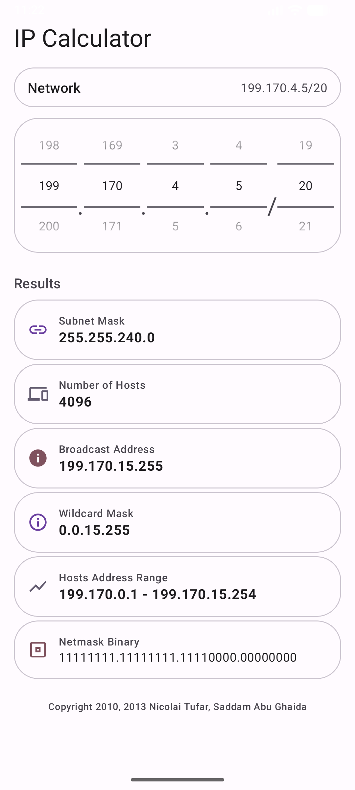

IPCalculator
===========

[](https://github.com/ntufar/IPCalculator/releases)
[](https://github.com/ntufar/IPCalculator)
[](https://github.com/ntufar/IPCalculator)
[](https://github.com/ntufar/IPCalculator)
[](https://github.com/ntufar/IPCalculator)
[](https://github.com/ntufar/IPCalculator)

IP subnet calculator for Android.



## Building

```bash
./gradlew assembleDebug
```

APK output: `app/build/outputs/apk/debug/app-debug.apk`

## Modernization

Migrated from Eclipse/ADT (API 11-17) to Gradle + Kotlin (API 21-36).

- Android Gradle Plugin 9.2.1
- Kotlin
- ViewBinding
- Material Components theme
- Min SDK 21, Target SDK 36, Compile SDK 36

## Website

The app landing page and privacy policy are in `site/` and deployed to GitHub Pages on every push via `.github/workflows/deploy-pages.yml`.

Visit: https://ntufar.github.io/IPCalculator/

